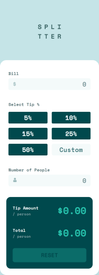

<h1 align="center">Tip Calculator app</h1>
<h2 align="center"><a href="https://frontendmentor.io">FEM</a>Challenge

### What's this? 🤔

Supose that you're on a restaurant with some friends and you want to calculate the amount of money by tip percentage that each one has to pay, plus the bill amount. **Tip Calculator** lets you easily do that! 

Input the amount of the bill, then select one of the predefined percentage values for the tip (or input a custom value), then introduce the number of people in your group. That's it!

**You don't have friends?** _Don't worry!_ **Tip Calculator** also has you covered as long as you are not a zero value!

### [Live preview 🎨](https://rwxdan.github.io/tip-calculator-app/)

|  |  |
| --- | --- |
|  |  |

    
    
    
